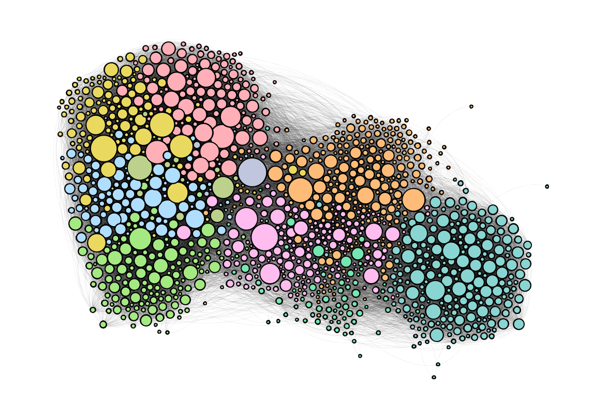
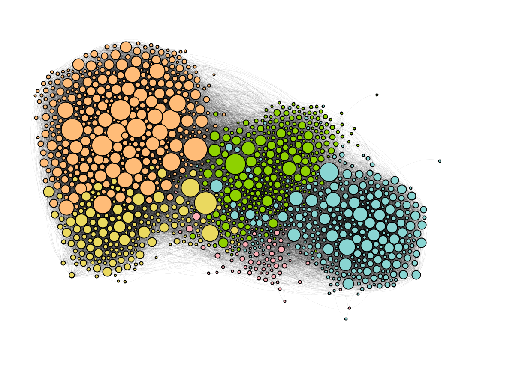
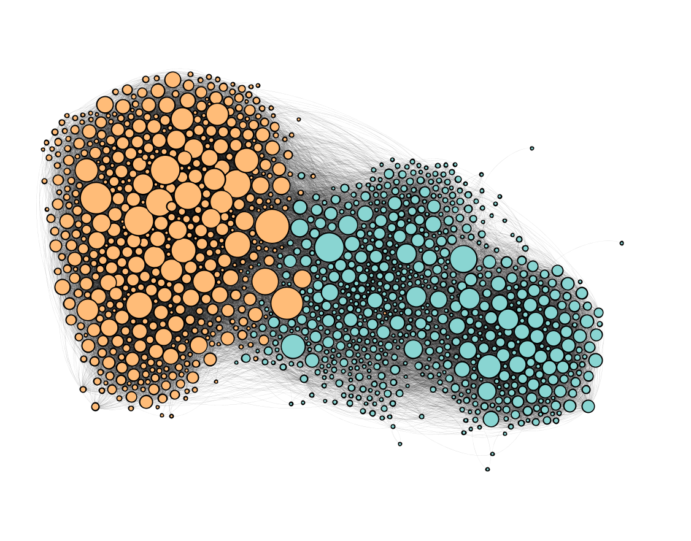

```{r setup, include=FALSE}
knitr::opts_chunk$set(message = FALSE, warning = FALSE, include = FALSE, eval = FALSE) 
library(DT)
library(knitr)
library(tidyverse)
```

name: low-resolution
class: center 

### Low Resolution 

$$Q = \frac{1}{W}\sum_C\Large( W_{C} - \frac{s^2}{4W}\Large)$$


.left[.footnote[<small> **Footnote** </small>]]

---
name: medium-resolution
class: center 

### Medium Resolution 



---
name: high-resolution
class: center 

### High Resolution 



